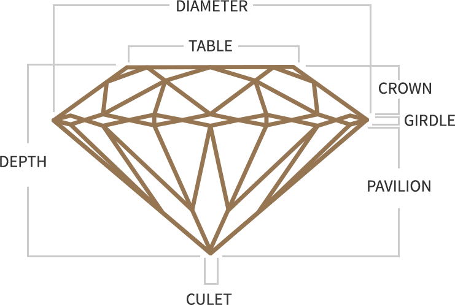

Visit my GitHub [here](https://github.com/tapiad).

Visit my [Portfolio](https://tapiad.github.io).

Link to Homework 2 [assignment](http://www.wou.edu/~morses/classes/cs46x/assignments/HW2.html). 

### Homework 2

Homework 2 is based off of [homework 1](https://tapiad.github.io/CS%20460/HW1/). This time we are not only using HTML, CSS, and Bootstrap, we have implemented Javascript and jQuery. We are to include multiple form elements of different types, and we are required to have a user input and action whether its by clicking on a button or selecting on a radio button, ect. It applies to use jQuery to modify one or more elements; add new elements, one of which must be a list or a tbale with multiple of child elements. On top of all this we need to demonstrate using Git `branch`, `checkout`; `merge`.


### Step 1: The Branch and the Checkout

Before creating the branch I created a new folder in my Git repository named *HW2*. In that folder I created another folder for the website files called *website*. In that folder I created an *index.html* file with a stylesheet (*styles.css*). 
Here you can I created a branch called `hw2-file`. I tried to be creative... After creation of the branch I used `git checkout` to have the head to hw2-file. At the end of it I simply checked if head is pointing towards `hw2-file` by executing `git branch`.  

<!-- branch/checkout -->
```bash
git branch hw2-file
git checkout hw2-file
git branch
* hw2-file
  master
```


### Step 2: Wireframe Mockup

This step of the homework we are to make a blue-print-like design of our website. We labeled out our design using classes like `container`, `row`, and `column`. I created my wireframe using an application called *Pencil*.


### Step 3: Javascript/jQuery Website

I created my website based off diamonds. I did this because I recently bought a ring with a diamond and I did my research on it and I found out how diamonds are calculated for their price. I wanted to do something similar and I found myself creating a webpage based off how to calculate a diamond's weight in carats.

**Heading and Body**

The first think I did to the webpage is starting working on the HTML file by adding in the head linking files such as style.css, bootstrap, and jQuery. Giving the wesite a title and making sure it is in Unicode Transformation Format.

```html
<!DOCTYPE html>
<html>
  <head>
    <title>CS460 HW2 Webpage</title>
    <meta charset="utf-8">
    <!-- css file -->
    <link rel="stylesheet" type="text/css" href="styles.css"> 
    <!-- Bootstrap CDN --> 
	<link rel="stylesheet" href="https://maxcdn.bootstrapcdn.com/bootstrap/3.3.7/css/bootstrap.min.css">
	<!-- Latest compiled JavaScript -->
	<script src="https://maxcdn.bootstrapcdn.com/bootstrap/3.3.7/js/bootstrap.min.js"></script>
    <!-- jQuery library-->
	<script src="https://ajax.googleapis.com/ajax/libs/jquery/3.2.1/jquery.min.js"></script> 
	<!-- jQuery UI -->
	<link rel="stylesheet" href="https://ajax.googleapis.com/ajax/libs/jqueryui/1.12.1/themes/smoothness/jquery-ui.css">
	<script src="https://ajax.googleapis.com/ajax/libs/jqueryui/1.12.1/jquery-ui.min.js"></script>
  </head>
```

I then added in the body which would contain the container with rows containing the header, an image, a paragraph, and another small header used as a footer.

```html
<body>
  	<!-- container -->
	<div class="container">
		<div class="row">
			<h1>DIAMOND WEIGHT</h1> <!-- Header -->
		</div>
		<div class="row">
			
		</div>
		<div class="row">
			<p>It is time to find out how much your diamond carat weight is.</p>
		</div>
		<!-- Note Line -->
		<div class="row">
			<h2><small>Note: Calculations are based on a rounded diamond shape.</small></h2>
		</div>		
	</div>
</body>
```

I then added some flavor by editing the styles.css file. I adding some color, padding, ect. to the elements on the webpage. In some cases, it will not allow me to modify an element. I would have to use `!important` for it to overwrite.

```css
html{
	background-color: #333333;
	margin: 20px 20px 20px 20px;
	padding: 20px 20px 20px 20px; /*values set top,right,bottom,left*/
}
body{
	align-content: center;
	border: 5px solid #a78644;
	margin: 0 auto;
	padding: 20px 20px 20px 20px;
}
h1 {
	font-size: 70px !important;
	text-align: center;
	margin: 0;/*space around outside of element*/
  	padding: 20px 0;/*space around content(paragraph)*/    
  	color: #333333;
}
p{
	font-size: 20px;
	text-align: center;
	padding-bottom: 25px;
	padding-top: 25px;
}
h2{
	font-size: 20px !important;
	text-align: center;
}
``` 

**Adding Bootstrap**

The first row is where I would contain three inputs(type number). I made sure each input had a column of four which would add to the total number of columns(12). The inputs are for the Diamond's length, width, and height.

Within the input it has a placeholder that reads '*e.g. 2.5mm*' so the user knows it's measured by millimeters. The minimum value a user can enter is 0.1mm and the highest amount is 25.4mm. I set it at 25.4mm because that measures out to exactly 1 inch. The step is by 0.1.
The second row is where I added a button for the user to click on to see the final result.

```html
<!-- Bootstrap Code -->
<!-- user inputs -->
<div class="row">
	<div class="col-sm-4">
		<form id="dLength">
		  Diamond's Length:
		  <input type="number" placeholder="e.g. 2.5mm" min="0.1" max="25.4" step="0.1">
		</form>
	</div>
	<div class="col-sm-4">
		<form id="dWidth">
		  Diamond's Width:
		  <input type="number" placeholder="e.g. 2.5mm" min="0.1" max="25.4" step="0.1">
		</form>
	</div>
	<div class="col-sm-4">
		<form id="dHeight">
		  Diamond's Height:
		  <input type="number" placeholder="e.g. 2.5mm" min="0.1" max="25.4" step="0.1">
		</form>
	</div> 
</div>
<!-- Calculate Button -->
<div class="row">
	<div class="text-center">
		<button type="button" class="btn btn-lg" id="cal_Button">Calculate Weight</button>
	</div>
</div>
<!-- End of Bootstrap Code -->
```

I added some color to the button so it won't look basic

```css
button{
	background-color: #a78644 !important;
	margin-top: 50px !important;
}
```

**jQuery**

Before I started working with jQuery, I added elements onto the page which will be later used when the button is clicked on. These are they elements: a hidden image of a diamond(*diamond-img*), a table(*table*) which will be filled with the values, and a paragraph(*cal-result*) stating the final result. 

```html
<!-- Diamond Image -->
<div class="row">
	
</div>
<!-- Table -->
<div class="col-lg-12">
	<table class="table-border" id="table"></table>
</div>
<!-- Result Line -->
<div class="row">
	<p id="cal-result"></p>
</div>
```

And you can't forget about adding some texture to the elements.

```css
table{
	border: 1px solid black;
	margin: 0px auto;
}
th, td {
	text-align: center;
	border-bottom: 1px solid black;
	padding-bottom: 5px;
}
h2{
	font-size: 20px !important;
	text-align: center;
}
```

Now onto working with jQuery. At the start of jQuery, I set *diamond-img* to be hidden. So when a user opens the webpage they won't able to see the image *diamond-img*.

```jQuery
<!-- jQuery Code -->
<script type="text/javascript">
	$("document").ready(function(){
		//Hide diamond-img
		$("#diamond-img").hide();
```  

Now onto the event action of the button click! this is where the party starts. Within the jQuery code there is an event method called `.click()` which takes action once a specific button is click on which in my case will be *cal_Button*. Note: `#` is for id and `.` is for classes. So referring to id of the button *cal_Button* it will look like `$("#cal_Button")` followed but the method `.click()` which contains a function call `function(){}`.

```jQuery
$("#cal_Button").click(function() { 
	//Event Action
})
```

Right after a user clicks on *cal-Button* the values entered by the user are inserted into variables(`var`) inside of the *//Event Action*. To get a value from an element it uses `.val()`. Since our input elements are of type number you will need to refer to that when referring to the element. ex: `$("#dLength input[type=number]")`. You can also just add in a string into a variable as I did into *coef* referring to coefficient. 

```jQuery
var dLValue = $("#dLength input[type=number]").val();
var dWValue = $("#dWidth input[type=number]").val();
var dHValue = $("#dHeight input[type=number]").val();
var coef = "0.009";
```

I then fixed *diamond-img*'s width and height. Note: at this moment the image is still hidden.

```jQuery
$("#diamond-img").width(300);
$("#diamond-img").height(250);
```

As I was doing some test runs I noticed the user can insert high values, low values, or no values. They are able to pass the limit of 25.4 or go lower that 0.1. I made sure they received an alert when ever they tried doing such. We can throw an alert at them by using a method call `alert()`.

```jQuery
if ((dLValue > 25.4) || (dWValue > 25.4) || (dHValue > 25.4)) { // checks for high values
	alert("Value too High!")
}else if ((dLValue < 0.1) || (dWValue < 0.1) || (dHValue < 0.1)) { // checks for low values
	alert("Invalid or Value too Low!");
}
```

I wanted my coefficient to be more realistic instead of having one mean value. I wanted it to change depend on the length divided by width ratio. If the ratio is below 1.0, then the coefficient is low. If the ratio is higher than 3.0, then the coefficient is high. Else the coefficient will stay the same at 0.009. Note: method `parseFloat()` returns a floating point number.

```jQuery
if ((parseFloat(dLValue) /  parseFloat(dWValue)) <= 1.0) {
	coef = "0.006";//Low Coefficient
}
if ((parseFloat(dLValue) /  parseFloat(dWValue)) >= 3.0) {
	coef = "0.012";//High Coefficient
}
```

Now that we have all the values that we need to find out the weight of a diamond in carats I decided to add it all into variable called *carats*. Note: Length x Width x Height x Coefficient = Weight in Carats. I found a this website to be helpful when finding a way [how to calculate a diamond's weight in carats](http://www.jewelrynotes.com/how-to-calculate-a-diamonds-weight-in-carats/). 

```jQuery
var carats = (parseFloat(dLValue) * parseFloat(dWValue) * parseFloat(dHValue) 
		* parseFloat(coef)).toFixed(3);
```

Depending on the how many carats the image of *diamond-img* can be resized. It can be smaller image if the carat weight is lower than 1.00 or it can be bigger image if the carat weight is higher than 5.00. After it has a fixed sized image, the image will be visible to the user by using the `show()` method call.

```jQuery
if (carats >= 5.00) {
	$("#diamond-img").width(500);
	$("#diamond-img").height(400);
}
if (carats <= 1.00) {
	$("#diamond-img").width(100);
	$("#diamond-img").height(90);
}
$("#diamond-img").show();
```

Now it is time to add in values to *table* and *cal-result*. The table will consist of the values of length, width, height, and coefficient. The paragraph will express the final result of *carats*. We are able to add values to elements through a method call named `append()`. 

```jQuery
$("table").append( '<tr><td>' + "<b>Diamond's Length:</b> "  +  dLValue + 'mm </td></tr>' );
$("table").append( '<tr><td>' + "<b>Diamond's Width:</b> "  +  dWValue + 'mm </td></tr>' );
$("table").append( '<tr><td>' + "<b>Diamond's Height:</b> "  +  dHValue + 'mm </td></tr>' );
$("table").append( '<tr><td>' + "<b>The Coefficient:</b> "  +  coef + '</td></tr>' );
//Final result
$("#cal-result").append("Congrats! Your diamond carat weight is <u>" + 
	carats + "</u> CARATS!");
```

**Javascript**

I wrote Javascript in a different file called *jScript.js*. I added the script in the bottom of the body of the html file. 

```html
<script src="jScript.js"></script>
```

As I was refreshing the webpage I noticed that the values with in the user input will still be showing the previous values. I created a function call `refresh()` and used a method called `reset` to set the value back to the origin value. Then I added the function call into window when it refreshes. 

```javascript
function refresh(){ //resets values when page refreshes
	document.getElementById("dLength").reset();
	document.getElementById("dWidth").reset();
	document.getElementById("dHeight").reset();
}
window.load = refresh();
```

Now that we have the values in the table we can add some flavor in our .css file.

```css
table{
	border: 1px solid black;
	margin: 0px auto;
}
th, td {
	text-align: center;
	border-bottom: 1px solid black;
	padding-bottom: 5px;
}
```


### Step 4: Merge Feature Branch

As I was working on this assignment I would be adding, commenting, and pushing the feature branch(*hw2-file*) away from the master branch.

```bash
git add .
git commit -m "modified files"
git push origin hw2-file
``` 

After adding and pushing, it is time to merge the branch with master. To merge your the feature branch to the master in need to make sure you have `checkout master` first and then `merge` and finally `push origin master`.

```bash
git checkout master
git merge hw2-file
git push origin master
```

You can visit my completed web-site here at [CS460 HW2 Webpage](website)!!!