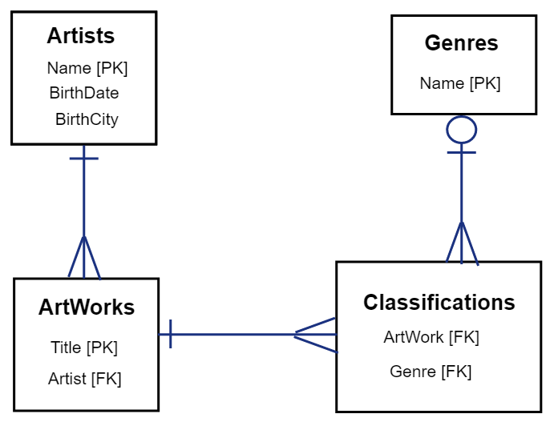

Quick Links:

* Visit my GitHub [here](https://github.com/tapiad).

* Visit my [Portfolio](https://tapiad.github.io).

* Link to Homework 8 [assignment](http://www.wou.edu/~morses/classes/cs46x/assignments/HW8.html).


### Homework 8

**Primary Objectives:**
1. Be able to write a MVC web application that uses a multi-table, relational database instance that you created
2. Be able to create models with foreign keys and navigation properties
3. Be able to implement CRUD functionality with non-trivial models
4. Learn to write more complex T-SQL scripts to create more complex database tables
5. Practice more LINQ
6. Implement custom attribute checking


**Overall Requirements:**

 * You must use a “Code First with an Existing Database” workflow
 * Use a script to create your tables, populate them with sample data and another to delete them; the script(s) need to be added and committed to your git repository
 * All pages must use strongly typed views
 * Use only fluent (dot notation) LINQ syntax

### Demo Video

[Video](https://youtu.be/pwJ_TzcrDYw)


### Step #1: Generate an E-R Diagram



### Step #2: Seed Data, UP & DOWN script

Using our UP script we are to seed the data into our database tables. We had to create four tables and insert data into those tables. To create a table use `CREATE TABLE` then *dbo.TableName*. `CONSTRAINT` are used to limit the type of data in the table. The *constraints* I use were `PRIMARY KEY` and `FOREIGN KEY` which uses `REFERENCES`. This is the UP script:

```sql
--ArtWorks Table
CREATE TABLE dbo.ArtWorks
(
    Title   VARCHAR(100)    NOT NULL,
    Artist  VARCHAR(50)     NULL
    
    CONSTRAINT [PK_dbo.ArtWorks] PRIMARY KEY (Title),
    CONSTRAINT [FK_dbo.ArtWorks] FOREIGN KEY (Artist)
    REFERENCES dbo.Artists (Name)
);
```

To seed the table use `INSERT INTO` followed by each *column name* and `VALUES`. Seed in each value respectivly.

```sql
--Insert data into ArtWorks Table
INSERT INTO dbo.ArtWorks (Title, Artist) VALUES
('Circle Limit III', 'M C Escher'),
('Twon Tree', 'M C Escher'),
('Mona Lisa', 'Leonardo Da Vinci'),
('The Vitruvian Man', 'Leonardo Da Vinci'),
('Ebru', 'Hatip Mehmed Efendi'),
('Honey Is Sweeter Than Blood', 'Salvador Dali');
```

To *DROP* a table out of the database use `DROP TABLE`. I used and if statement to check if the table to exists.

```sql
--Drop Table ArtWorks
DROP TABLE IF EXISTS dbo.ArtWorks;
``` 

### Step #3: CRUD

*CRUD* (Create, Read, Update, Delete) functionality for Artist. So much code to go over, I'll cut it short. We will take a look at the *CreateArtist.cshtml* View. This will let the user know what value to enter to create a new artist.

```html
@using (Html.BeginForm())
{
    @Html.AntiForgeryToken()

    <div class="form-horizontal">
        <h4>Artist</h4>
        <hr />
        @Html.ValidationSummary(true, "", new { @class = "text-danger" })
        <div class="form-group">
            @Html.LabelFor(model => model.Name, htmlAttributes: new { @class = "control-label col-md-2" })
            <div class="col-md-10">
                @Html.EditorFor(model => model.Name, new { htmlAttributes = new { @class = "form-control" } })
                @Html.ValidationMessageFor(model => model.Name, "", new { @class = "text-danger" })
            </div>
        </div>

        @*Code Omitted*@

        <div class="form-group">
            <div class="col-md-offset-2 col-md-10 btn-group">
                <input type="submit" value="Create" class="btn btn-primary" />
                @Html.ActionLink("Cancel", "Artists", null, new { @class = "btn btn-danger" })
            </div>
        </div>
    </div>
}
```

Once the user has added the values, it takes a *POST* action which will be handled in the controller. Checks if the the user's values are vaild. If it is, then save it to the database!

```cs
// POST: Home/CreateArtist
[HttpPost]
[ValidateAntiForgeryToken]
public ActionResult CreateArtist([Bind(Include = "Name, BirthDate, BirthCity")] Artist artist)
{
    if (ModelState.IsValid)
    {
        db.Artists.Add(artist);
        db.SaveChanges();
        return RedirectToAction("Artists");
    }
    return View(artist);
} 
```

### Step #4: JSON & AJAX

First we will display the buttons in which the user can select which genres they will like to see. After the button is clicked, it will make a JSON and AJAX call.

```html
@*Genres Buttons*@
<div class="btn-group">
    @foreach (var genre in Model)
    {                               
        <input class="btn btn-default" type="button" value=@genre.Name onclick="genreClicked('@genre.Name')" />
    }
</div>
<br />
@*Display Results*@
<div id="results" style="display: none">
    <table class="table table-hover table-responsive">
        <thead>
            <tr>
                <th>Art Work</th>
                <th>Artist</th>
            </tr>
        </thead>
        <tbody id="resultsBody">

        </tbody>
    </table>
</div>
<br />

@section scripts
{
    <script type="text/javascript" src="~/Scripts/genDetail.js"></script>
}
```


`JsonRuesult` gets the data to return a JSON Object.

```cs
// Returns a JSON Object
public JsonResult GenreDetails(string id)
{
    //Data
    var data = db.Genres.Where(g => g.Name == id)
                         .Select(s => s.ArtWorks)
                         .FirstOrDefault()
                         .Select(s => new { s.Title, s.Artist }) 
                         .OrderBy(o => o.Title)
                         .ToList();
    //return Json Object
    return Json(data, JsonRequestBehavior.AllowGet);
}
```

The AJAX:

```js
function genreClicked(genre) {
    //URL Display
    var source = "/Home/GenreDetails/" + genre;
    $.ajax({
        type: "GET",
        dataType: "json",
        url: source,
        success: displayResults,
        error: error
    });
}
```

This is the function to display the results:

```js
function displayResults(data) {
    //Where result is Displayed
    var item = document.getElementById("resultsBody");
    //For each data
    jQuery.each(data, function (i, val){
        if (i == 0)
        {   //Adds 'Title' & 'Artist' to Table
            item.innerHTML = '<tr><td>' + val["Title"] + '</td><td>' + val["Artist"] + '</td></tr>';
        }
        else
        {
            item.innerHTML += '<tr><td>' + val["Title"] + '</td><td>' + val["Artist"] + '</td></tr>';
        }
    });
    $("#results").css("display", "block"); //Makes Table Visible
}

```

