Quick Links:

* Visit my GitHub [here](https://github.com/tapiad).

* Visit my [Portfolio](https://tapiad.github.io).

* Link to Homework 9 [assignment](http://www.wou.edu/~morses/classes/cs46x/assignments/HW9.html).

### Homework 9

**Primary Objectives:**
1. Be able to write a complex MVC web application and deploy to the cloud
2. Learn how to provision and deploy a database to the cloud

**Overall Requirements:**

* Use Azure for both the web application and the database
* Must build the database from script files that are maintained in your project under Git
* Your database password cannot appear in your Git repository

### Step #1: Create the Database Remotely on Azure

To create a database remotely on Azure you first have to create and subscribe to Azure on their [website](https://azure.microsoft.com/en-us/features/azure-portal).

* Click on **+ New** located on the top left of Azure Portal
* Click **Databases**
* Final click on **SQL Database**
* Then just fill in the information to create you SQL Database!

> Note: These is also a quick *SQL databases* on the side menu

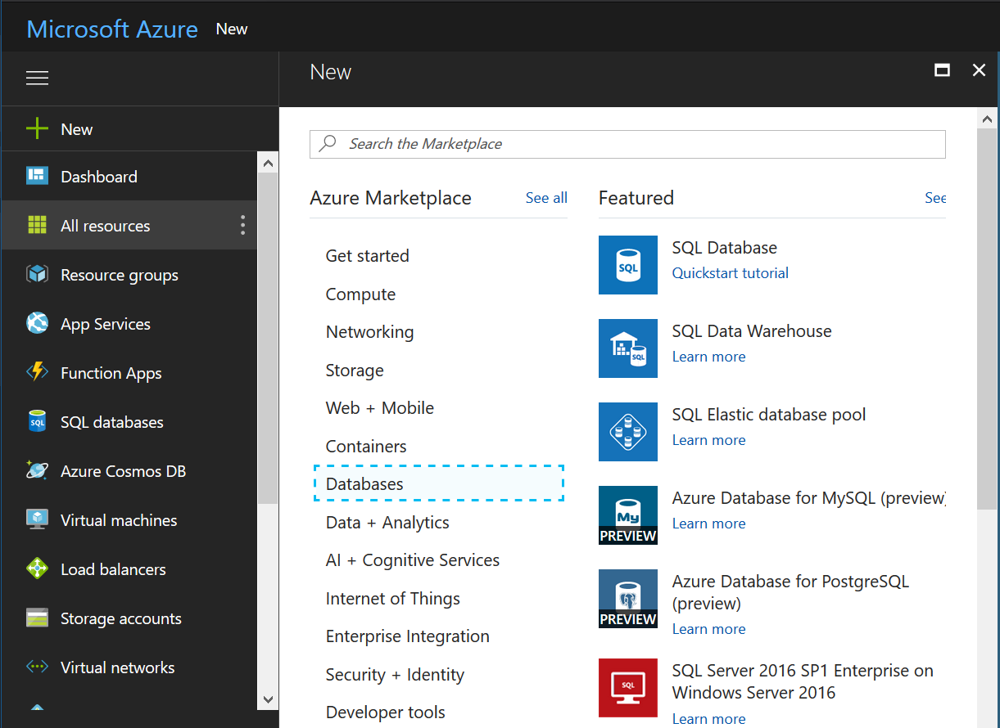
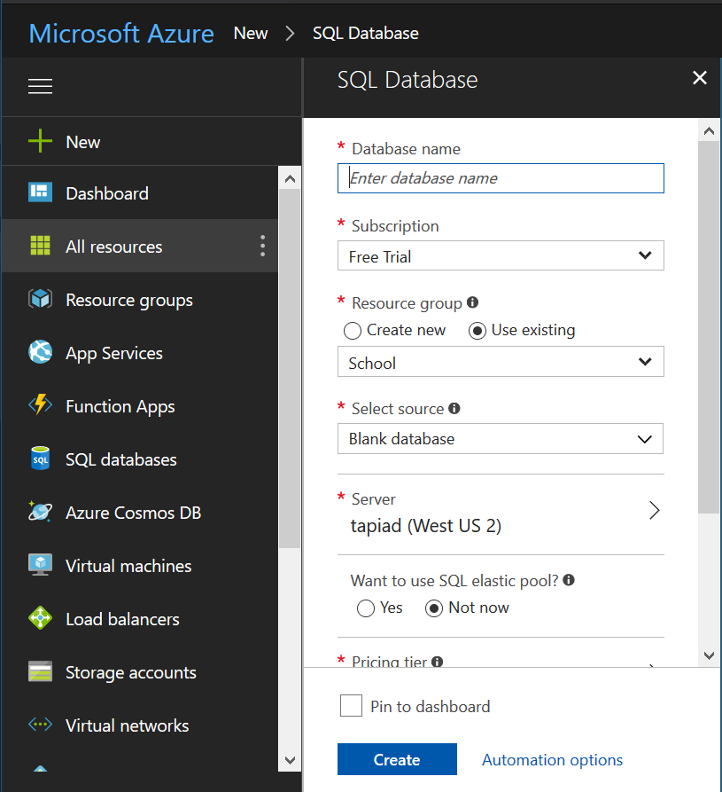

### Step #2: Deploy the web application on Azure

* Same as adding a database, click on **+ New**
* Click **Web + Mobile**
* Select **Web App**
* Fill out the form

> Note When adding a Database/Web App it will take some time to deploy

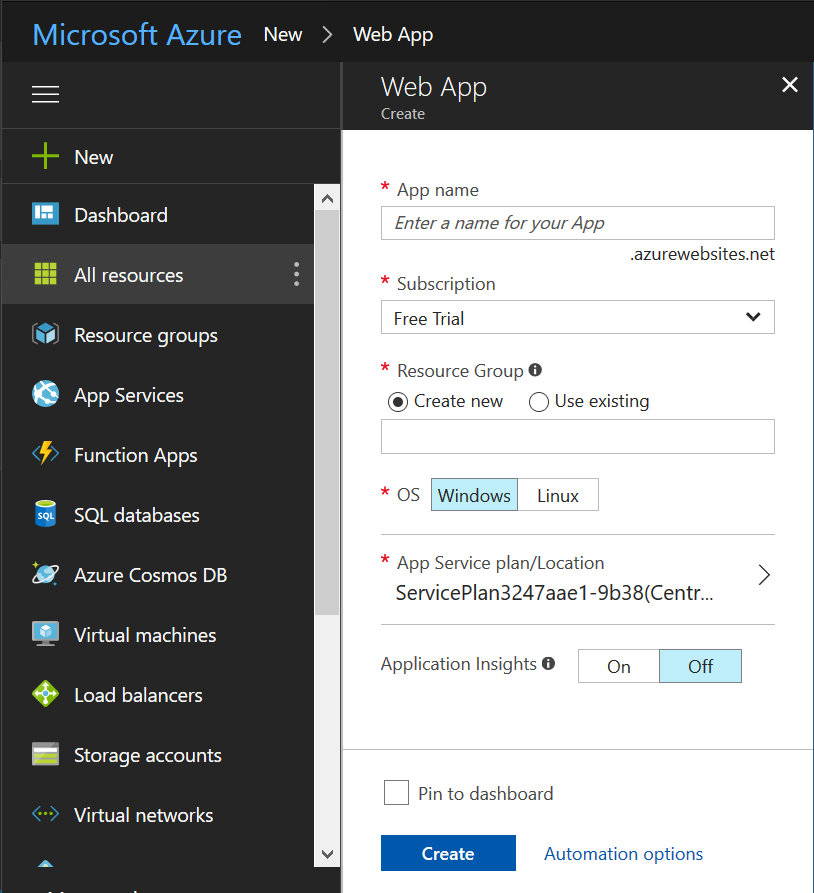 

### Step #3: Deploying

After completing your web application, on Microsoft Visual Studio you will want to connect to Azure Database the one you created. This is located in the *up.sql* script:  

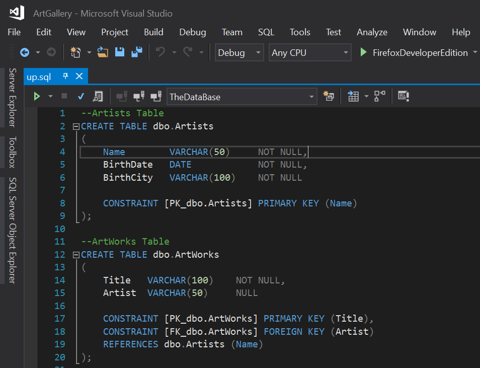

> Note: You will need to login to your Azure

After adding table to the Azure Database you will want to *Publish*. Right-click on your project's name and search for **publish...**

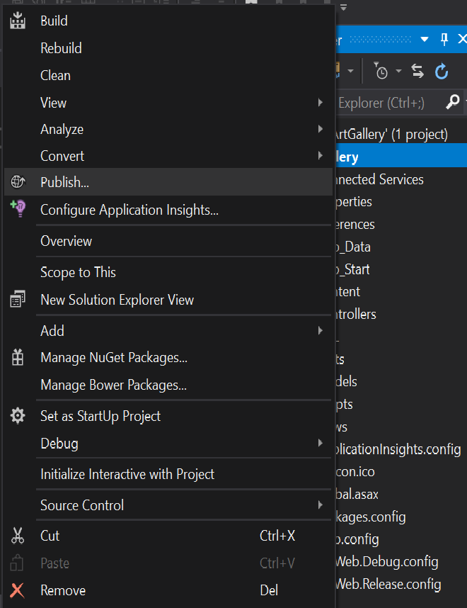

After clicking, you are going to **import profile** where it is going to ask you for a publish profile. You will need to download this from you *App Service* on Azure. This is called **Get publish profile**. Save it where you will be able to find it. 

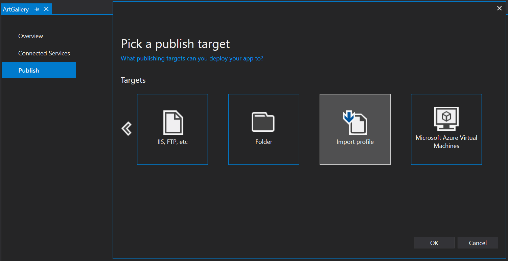

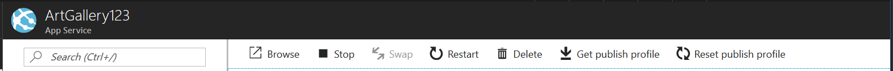

This will take you to your Azure website but we will need to go back to add the *string connection* if you still want to update and add more to your web application.

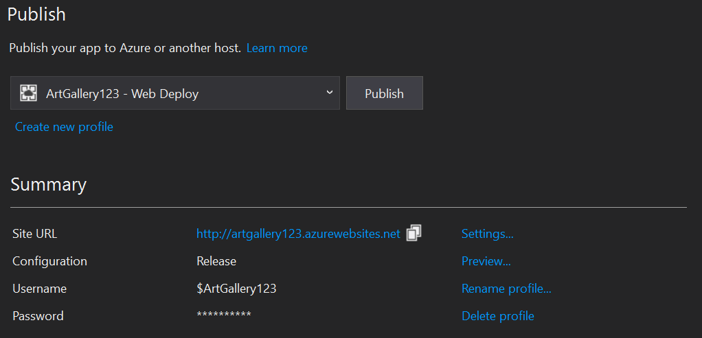

* Click on **Settings...**
* Validate Connection

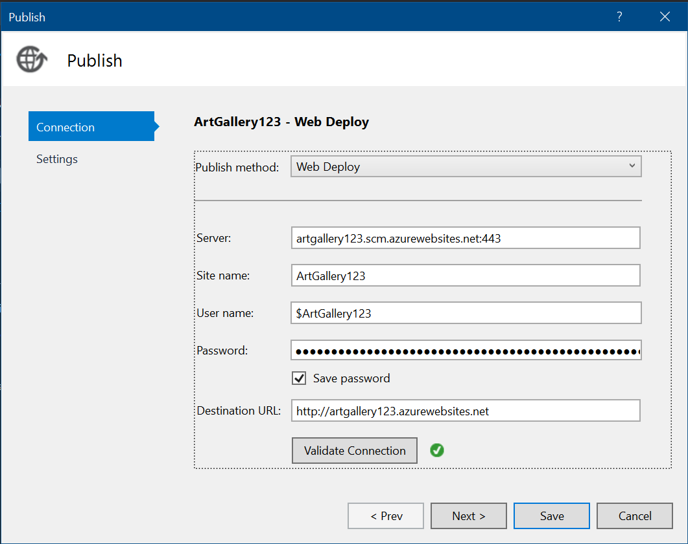

* Click **Next >**
 
 Now, go back to your Azure Portal and click on your database. Under *Connection strings* click on **Show database connection strings**. This will take you to your ADO.NET (SQL authentication) where you will need to copy and paste. This will be added in the **Remote connection string**:

 
 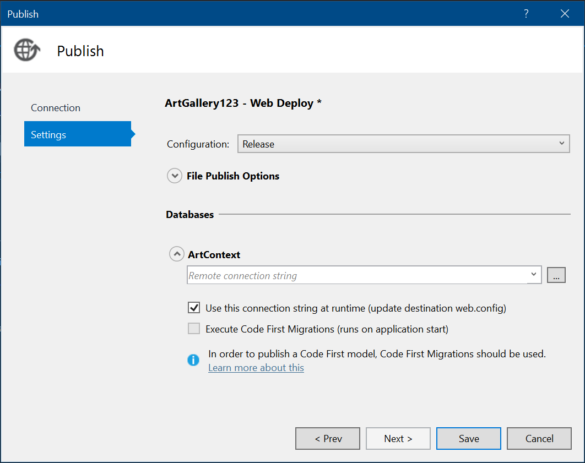

 * Click **Save**
 
 Now for the final step click on **Publish**! This will take a minute or two to load and deploy your web application onto Azure.

 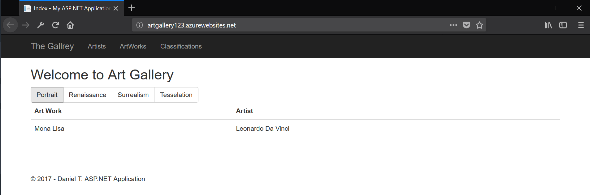

 You successfully deplored your web application!

